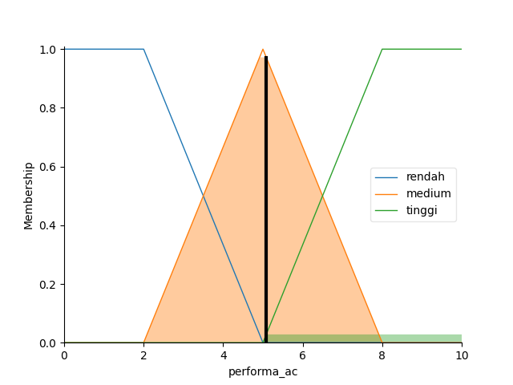
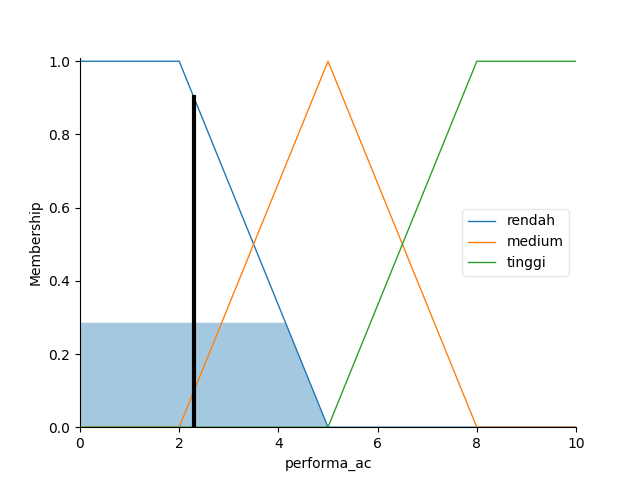
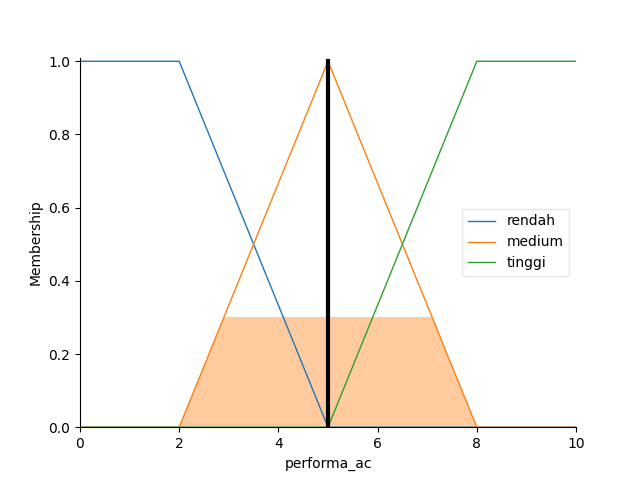

# PENGGUNAAN AIR CONDITIONING MENGGUNAKAN SISTEM FUZZY TYPE-2
Final Project kelas Kecerdasan Buatan E081

<br>

Nama: Sultan Rizqyllah

NPM: 21081010274

Kelas: KCB E081

<br>

Program ini dibuat untuk mengetahui keefektifitasan kontrol algoritma fuzzy type-2 jika diimplementasikan ke AC dalam kehidupan sehari-hari.

Paper dalam bentuk soft copy file pdf berada di folder assets

<br>

## Pendahuluan

Data dari laporan suhu di lingkungan dalam ruangan di kota Surabaya menunjukkan kegunaan Air Conditioning (AC) agar bisa mempernyaman suhu ke temperature yang tepat. Penggunaan kontrol adaptif dari logika fuzzy type-2 akan membantu untuk mengoptimalkan performa dan menghemat energi secara bersamaan. 

Percobaan yang dilakukan akan disimulasikan menggunakan program dengan bahasa python menggunakan library yang bernama scikit-fuzzy yang memiliki banyak alat yang dibutuhkan untuk menjalankan proses algoritma fuzzy type-2 dan library matplotlib yang memperbolehkan kita untuk melihat hasil output secara visual dengan grafik. IDE atau code editor yang digunakan adalah visual studio code.

Data yang digunakan adalah derajat suhu sehari-hari selama satu minggu yang dirata-rata lalu akan data yang telah dikumpulkan akan direlasikan dengan variabel output melalui beberapa aturan-aturan yang akan dibuat.

<br>

## Struktur Program
Pertama, kita harus menginstal library pada python melalui pip melalui terminal.
Berikut adalah code untuk menginstall library yang dibutuhkan, yaitu matplotlib, scikit-fuzzy, dan numpy.

`pip install scikit-fuzzy`

`pip install matplotlib`

Lalu, import semua library yang diperlukan

```
import numpy as np
import skfuzzy as fuzz
from skfuzzy import control as ctrl
import matplotlib.pyplot as plt
```

Setelah itu, kita harus membuat variabel fuzzy terlebih dahulu. Berikut adalah variabel yang bisa mensimulasikan kontrol Air Conditioning menggunakan logika Fuzzy Type-2

```
temperature = ctrl.Antecedent(np.arange(0, 51, 1), 'temperature')
performa_ac = ctrl.Consequent(np.arange(0, 11, 1), 'performa_ac')
```

Bisa dijelaskan dari code diatas bahwa variabel temperature adalah input (Antecedent) dengan range suhu antara 0 derajat sampai 50 derajat yang merepresentasikan suhu ruangan. Dan variabel performa_ac sebagai output (Consequent) dengan range 1 sampai 10 yang merepresentasikan persentase penggunaan power/performa AC.

Lalu, kita harus mendefinisi fungsi membership kedua variabel ke dalam kategori-kategori dingin, biasa, dan panas untuk variabel suhu ruangan. Dan kategori rendah, medium, dan tinggi untuk variabel performa AC.

Membership Function Temperature:

```
temperature['dingin'] = fuzz.trapmf(temperature.universe, [0, 0, 20, 25])
temperature['biasa'] = fuzz.trimf(temperature.universe, [20, 25, 30])
temperature['panas'] = fuzz.trapmf(temperature.universe, [29, 40, 50, 50])
```

*	Kategori dingin ditentukan jika suhu mulai dari 0 derajat sampai 25 derajat
*	Kategori biasa ditentukan jika suhu mulai dari 20 derajat sampai 30 derajat
*	Kategori panas ditentukan jika suhu mulai dari 29 derajat sampai 50 derajat
*	Jika suhu kurang dari 0 atau lebih dari 50 maka input akan tidak valid

<br>

Membership Function Performa AC:

```
performa_ac['rendah'] = fuzz.trapmf(performa_ac.universe, [0, 0, 2, 5])
performa_ac['medium'] = fuzz.trimf(performa_ac.universe, [2, 5, 8])
performa_ac['tinggi'] = fuzz.trapmf(performa_ac.universe, [5, 8, 10, 10])
```

*	Kategori rendah ditentukan jika value performa AC mulai dari 0 sampai 5
*	Kategori medium ditentukan jika value performa AC mulai dari 2 sampai 8
*	Kategori tinggi ditentukan jika value performa AC mulai dari 5 sampai 10
*	Jika suhu kurang dari 0 atau lebih dari 10 maka tidak valid

<br>

Kategori-kategori variabel diatas akan dihubungkan melalui relasi dengan aturan yang telah kita tentukan, berikut adalah aturan-aturan yang ditentukan:

1. Aturan 1 : Jika temperature DINGIN, maka performa AC TINGGI
2. Aturan 2 : Jika temperature BIASA, maka performa AC MEDIUM
3. Aturan 3 : Jika temperature PANAS, maka performa AC RENDAH

```
aturan1 = ctrl.Rule(temperature['dingin'], performa_ac['tinggi'])
aturan2 = ctrl.Rule(temperature['biasa'], performa_ac['medium'])
aturan3 = ctrl.Rule(temperature['panas'], performa_ac['rendah'])
```

Setelah kita menentukan relasi antara 2 variabel input dan output, kita harus mengatur fuzzy kontrol sistem antara ke-tiga aturan yang telah kita buat.

```
control_system = ctrl.ControlSystem([aturan1, aturan2, aturan3])
aircon_controller = ctrl.ControlSystemSimulation(control_system)
```

Lalu, kita harus memasukkan input suhu temperatur untuk di komputasi menggunakan algoritma fuzzy

```
while True:
    suhu = float(input('Suhu: '))
    if (suhu > 50 or suhu < 0):
        print('Suhu tidak tepat\n')
    else:
        break

aircon_controller.input['temperature'] = suhu
aircon_controller.compute()
```

Untuk melihat **OUTPUT**

```
print(aircon_controller.output['performa_ac'])
persen = aircon_controller.output['performa_ac'] / 10 * 100
print(f'Persentase power penggunaan AC: {round(persen)}%')

performa_ac.view(sim=aircon_controller)
plt.show()
```

## Output

Berikut adalah beberapa output dari program berdasarkan data yang telah dikumpulkan

<br>

Input suhu temperature sekitar 24 derajat



<br>

Input suhu temperature sekitar 32 derajat



<br>

Input suhu temperature sekitar 28 derajat


